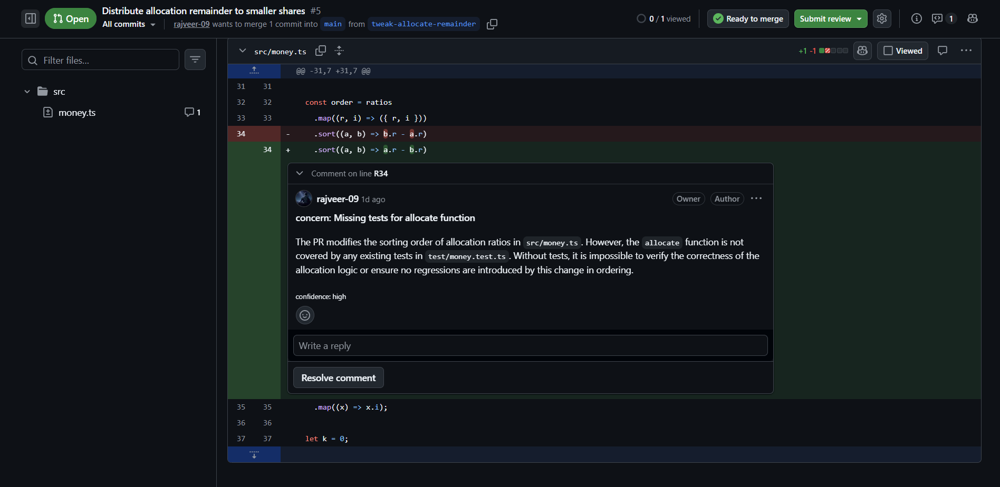
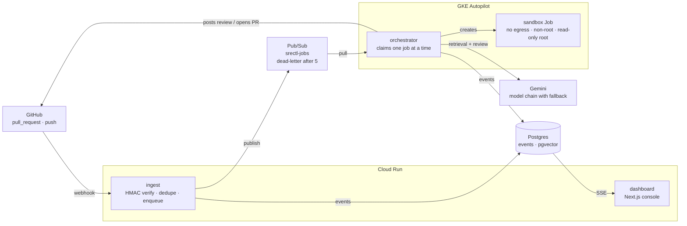
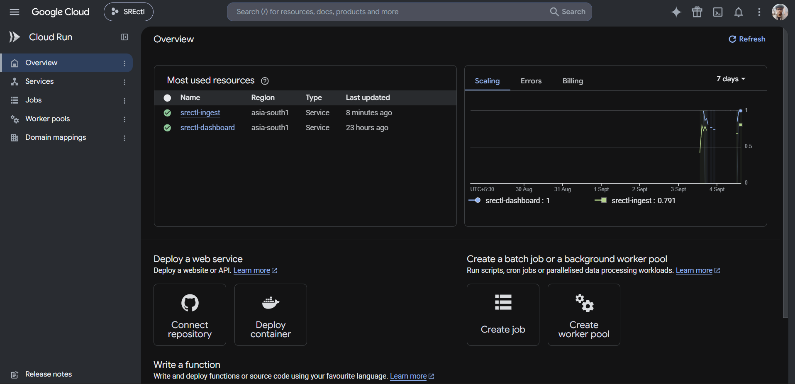
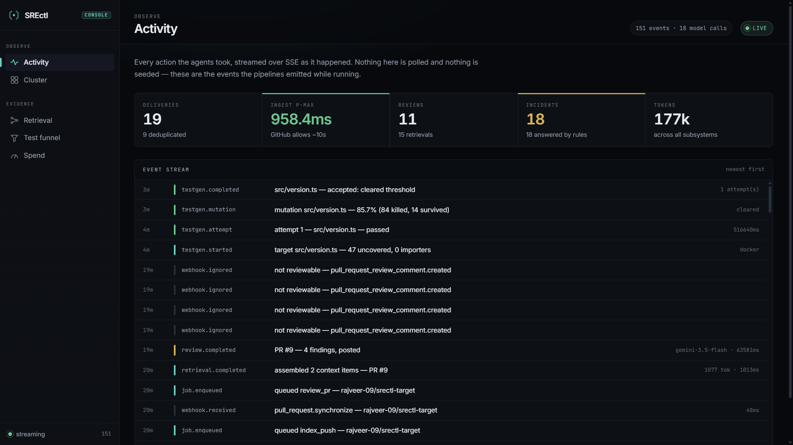
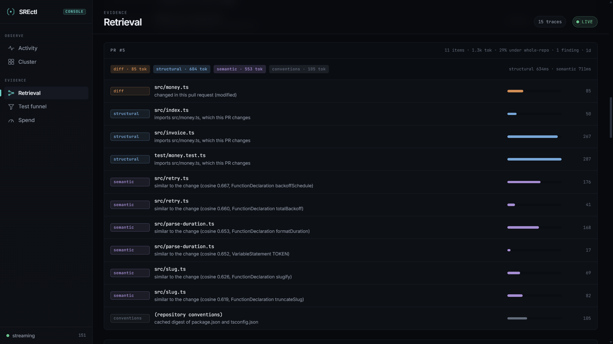
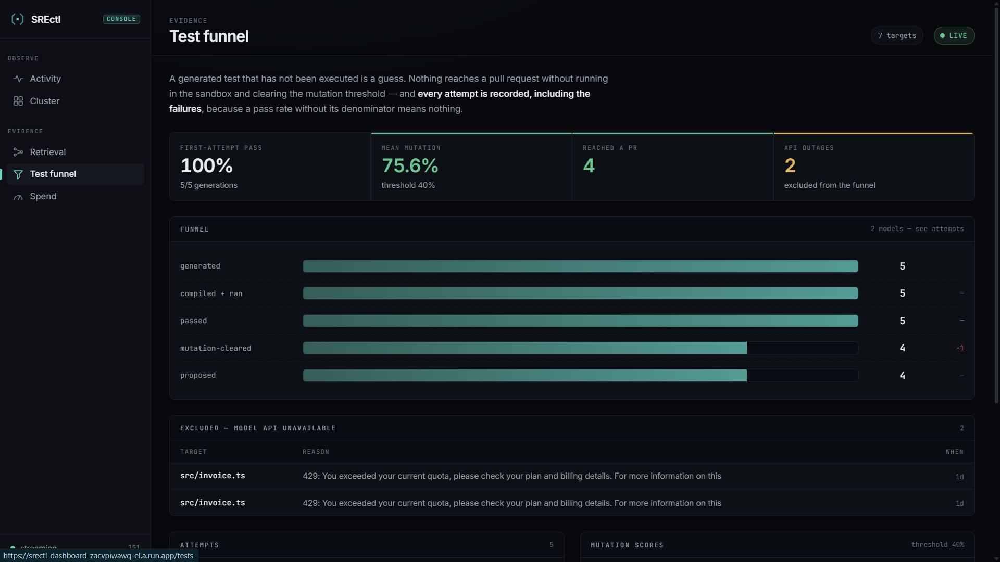
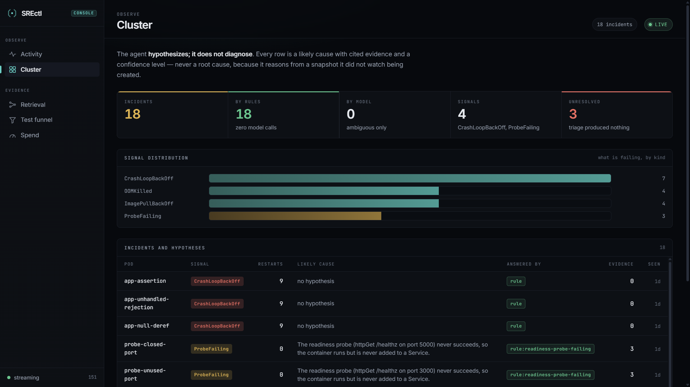
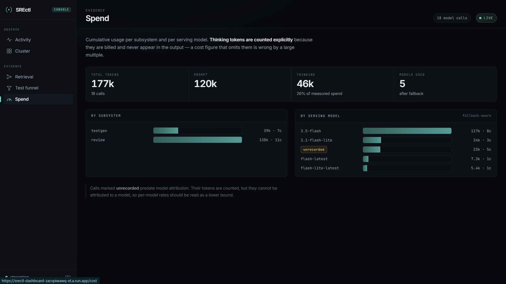

# SREctl

Autonomous code review and reliability agent. Reviews pull requests with
repository-aware context, writes unit tests and verifies they work before
proposing them, executes untrusted code inside a hardened Kubernetes sandbox,
and watches the same cluster for failing workloads.

TypeScript, Google ADK, Kubernetes.

| | |
| :-- | :-- |
| **[Live dashboard &rarr;](https://srectl-dashboard-zacvpiwawq-el.a.run.app)** | Read-only console on Cloud Run, reading the live event store |
| **[Target repository &rarr;](https://github.com/rajveer-09/srectl-target)** | The repository the agent reviews. Its reviews, findings and generated-test pull requests are public |
| **[Source](https://github.com/rajveer-09/SREctl)** | This repository |

## What it looks like

A finding the agent posted on a real pull request, anchored to the diff line it
concerns, with its confidence stated.



## What it does differently

- **Nothing is proposed that has not been executed.** A generated test that has
  not run is a guess, so tests are run in a sandbox and mutation-scored before a
  pull request exists.
- **Repository content is untrusted input.** Diffs and file contents are wrapped
  in nonce-delimited blocks, never followed as instructions, and the write path
  allowlist is computed in code before any model runs.
- **Failures are counted.** An upstream model outage is recorded as an outage,
  not as a test that failed or a review that found nothing.
- **No autonomous writes.** The agent opens pull requests and files findings;
  humans merge.

## Architecture



Ingest answers GitHub inside its ~10s delivery timeout and does no agent work.
The orchestrator runs in-cluster, where a review taking minutes is not a
problem, and creates sandbox Jobs for anything that executes untrusted code.

Both HTTP services scale to zero, so an idle deployment costs nothing and the
only hourly charge is the cluster, which is torn down between sessions.



## Demo

The console reads the event store directly. Every figure below was produced by
the pipelines running, not seeded — including the failures.

### Activity

Every action the agents took, streamed over SSE as it happened.



### Retrieval

Why each file entered the context bundle. Structural neighbours come from a real
import graph, which is how a caller three directories away gets found —
embedding similarity would not surface it, because it shares no vocabulary with
the change.



### Test funnel

A generated test that has not been executed is a guess. Nothing reaches a pull
request without running in the sandbox and clearing the mutation threshold. Runs
lost to a model outage are excluded from the funnel rather than counted as
quality failures — an upstream 429 is not a test that failed.



### Cluster

The agent hypothesizes; it does not diagnose. Every row is a likely cause with
cited evidence and a confidence level, and the rules answer first so the model
is only asked about genuinely ambiguous signals.



### Spend

Thinking tokens are counted explicitly, because they are billed and never appear
in the output. Usage is split by the model that actually served each call, since
automatic fallback means one run can be served by a different model than the one
requested.



## Layout

```
apps/ingest        webhook receiver — HMAC verification, dedupe, enqueue
apps/dashboard     Next.js console — SSE event stream, retrieval traces, funnel
packages/core      event vocabulary, event store, queue, config
packages/retrieval hybrid retrieval — ts-morph import graph + pgvector
packages/agents    review, test-generation and SRE agents; trust boundary
packages/sandbox   two-phase execution — DockerRunner and K8sJobRunner
packages/github    Octokit client, path allowlist, PR and review writers
packages/monitor   Watch API, incident correlation, deterministic triage rules
infra/             runner image, Kubernetes namespace, NetworkPolicy, RBAC
eval/              chaos fixtures and scoring harness
```

## Setup

```bash
pnpm install
cp .env.example .env      # fill in: webhook secret, Neon URL, Gemini key, PAT
pnpm db:migrate
pnpm build:runner         # builds and loads the sandbox image
```

## Commands

```bash
pnpm test                 # unit tests
pnpm typecheck

pnpm index                # build the import graph and embed the corpus
pnpm retrieve --pr N      # print the context bundle with per-item reasons
pnpm review --pr N        # review a PR (add --post to publish)
pnpm testgen              # generate → run → repair → mutation-score → PR

pnpm test:isolation       # prove the sandbox guarantees on Kubernetes
pnpm chaos:up             # seed deliberately broken pods
pnpm eval:chaos           # score triage accuracy against known faults

pnpm dev:dashboard        # console on :3100
pnpm models               # model chain status and quota cooldowns
```

## Design constraints

- Nothing is proposed that has not been executed. A generated test that has not
  run is a guess.
- Repository content is untrusted input. It is wrapped, never followed, and the
  path allowlist is computed in code before any model runs.
- The reliability monitor ranks hypotheses with cited evidence. It does not
  claim root causes.
- No autonomous writes to production. The agent opens pull requests; humans
  merge.

## License

MIT © 2026 Rajveer Sharma
